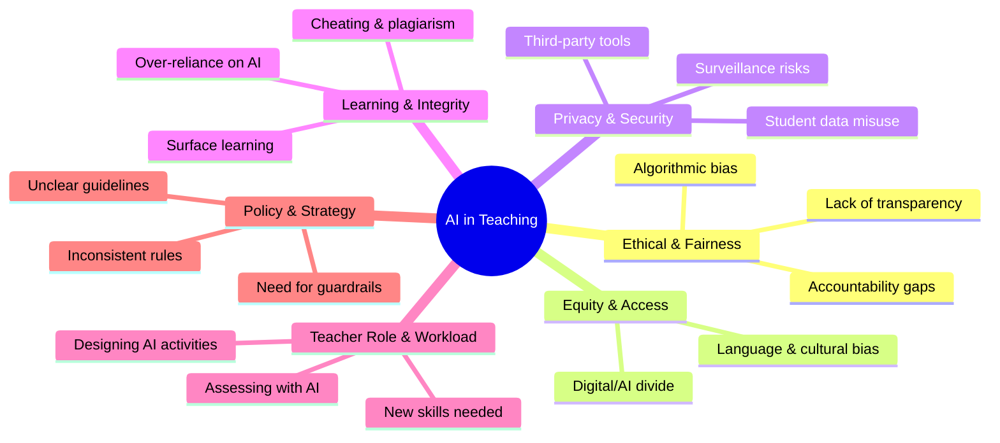

## Mermaid overview

This mindmap shows the key concern areas when integrating AI into teaching:

```mermaid
mindmap
  root((AI in Teaching))
    Ethical & Fairness
      Algorithmic bias
      Lack of transparency
      Accountability gaps
    Equity & Access
      Digital/AI divide
      Language & cultural bias
    Privacy & Security
      Student data misuse
      Surveillance risks
      Third-party tools
    Learning & Integrity
      Over-reliance on AI
      Cheating & plagiarism
      Surface learning
    Teacher Role & Workload
      New skills needed
      Designing AI activities
      Assessing with AI
    Policy & Strategy
      Unclear guidelines
      Inconsistent rules
      Need for guardrails
```

---
