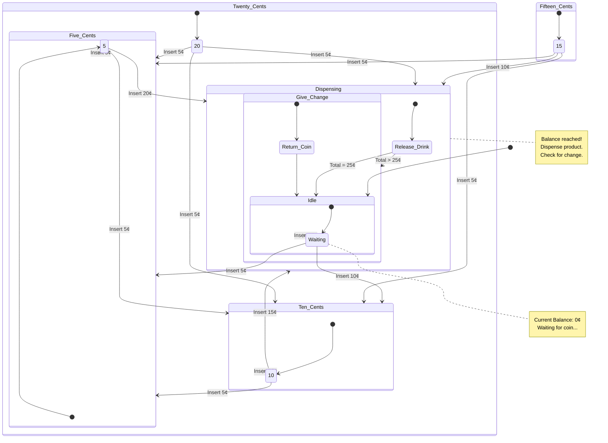

# State Transition Diagram

Here is a [state diagram](https://en.wikipedia.org/wiki/State_diagram) generated by [Z.ai](https://en.wikipedia.org/wiki/Z.ai) for a standard **Vending Machine** logic.

In this example:
*   **Product Cost:** 25 cents
*   **Accepted Coins:** Nickel (5¢), Dime (10¢), Quarter (25¢)
*   **The Machine** waits for payment, dispenses a drink when enough money is collected, and gives change if necessary.

---

## Explanation of States & Transitions

Here is the logic represented in the diagram above:

### 1. The States
*   **Idle / Waiting (0¢):** The machine is ready. The balance is 0.
*   **Five_Cents (5¢):** Total money inserted is 5¢.
*   **Ten_Cents (10¢):** Total money inserted is 10¢.
*   **Fifteen_Cents (15¢):** Total money inserted is 15¢.
*   **Twenty_Cents (20¢):** Total money inserted is 20¢.
*   **Dispensing:** The target amount (25¢) has been reached or exceeded. The machine releases the product.
*   **Give Change:** If the user inserted more than 25¢ (e.g., three dimes), this state returns the excess coins before resetting.

### 2. The Transitions (Logic)
*   **Insert Nickel (+5¢):** Moves the machine to the next higher state (e.g., 0¢ $\rightarrow$ 5¢ $\rightarrow$ 10¢).
*   **Insert Dime (+10¢):** Jumps the machine forward two states (e.g., 5¢ $\rightarrow$ 15¢).
*   **Insert Quarter (+25¢):** From the Idle state, this immediately triggers the **Dispensing** state.
*   **Dispensing $\rightarrow$ Give Change:** Occurs if the total balance was strictly greater than 25¢.
*   **Give Change / Dispensing $\rightarrow$ Idle:** Resets the machine balance to 0 for the next customer.
